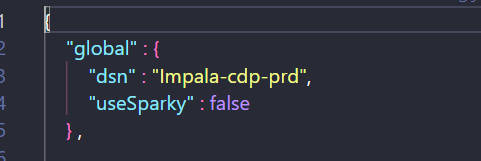

Rutinas:
Para realizar la Migración de la rutina de onpremise a CDP PC
Se requieren realizar los siguientes cambios:

1. Realizar un cambio en el config.json de las rutinas como se muestra a continuación:




Aca te adjunto en Codigo :
   ```
	"global" : {
      "dsn" : "Impala-cdp-prd"
      "useSparky" : false
      }
   ```
    
    Es importante colocar el parametro `"userSparky" : False`
    Ya que por ahora no se están habilitando las rutinas con SPARK, solo con HIVE y HUE
   
    
Estos son los cambios que se deben de realizar a nivel de rutina, no son mas.
2. Disponibilización de las tablas necesarias para las rutinas:
   En este punto debemos de asegurarnos que la rutina que deseamos migrar  nube, cuente con las suficientes tablas para correr correctamente.
   
   Para lograr esto se debe de crear una HU con antelación para subir las tablas a CDP PC 
   a la cuenta de modelos analiticos y recrear las tablas en el DATAHUB de  **bancolombia-de-prd01**
   la cual es una experiencia que se tiene habilitada para este fin.
   
   Es importante Aclarar que si las tablas son de crudos o resultados, estás serán atentidas por 2 equipos diferentes:
   
   **DATOS CRUDOS** -----------> Se encargará el equipo de SAS
   **DATOS RESULTADOS**  -------------> Se encargará el equipo de la LZ
   
   Para en caso de los datos de resultados Se debe de expresar que cantidad de información requieren en nube:
   
   algunas opciones son:
	   a. ULTIMA PARTICIÓN ----------> Data más nueva.
	   b. HISTORICOS -------------> Data Historica de la tabla, partiendo desde su principio excepto los ultimos X Dias.
3.  Pull_requests:
   
   Para el caso de los pullrequest se seguiran trabajando como se ha estado realizando en la calendarización 2.0 de rutinas
4.  Releases en nube :
   
   ya no se realizará en despliegue en **AW1003001_CDH_PyEnvs** 
   Ahora se realizará en  NU0280001_CDP_Public_Cloud_PyEnvs ------->https://grupobancolombia.visualstudio.com/Vicepresidencia%20Servicios%20de%20Tecnolog%C3%ADa/_git/NU0280001_CDP_Public_Cloud_PyEnvs?path=/&version=GBtrunk  En caso de que se requiera desplegar en nube
   
   
   Acotinuación se presenta un modelo operativo en BIG-Picture:
   
   
Acontinuación se adjunta un paso a paso para desplegar una rutina en el pipeline de nube
   
<iframe src="https://scribehow.com/embed/How_to_Create_and_Deploy_Release-40__Fj8p8kXXQDuTfLRbCthIXQ" width="100%" height="640" allowfullscreen frameborder="0"></iframe>

 

   
   


